## Computer Vision Portfolio Template

*Author name: Troels Høst*
*Education: IT-Technology*

## Table of contents

* Introduction
* Problem statements
    * Use case 1
    * Use case 2
* Methodology and process
    * Use case
* Results and final evaluation
    * Use case
* Appendix

## Introduction

The use of computer vision to solve many problems that has hitherto required human involvement is an exciting and developing field.
In this paper the use of computer vision is demonstrated in different use cases. One involving classifying shapes,
one in which computer vision is used to scan and rotate objects in pictures and one where computer vision is used to find faces in a picture.

## Problem statement

### Use case 1

To take geometric shapes and classify them according to the classical names of geometric shapes, i.e. right triangle, triangle etc.

### Use case 2

To find faces in a video stream.

## Methodology and process

### Use case 1 - Classifying shapes

### Methodology and process

In these pictures the different shapes are to be classified by type. 
 
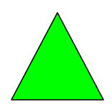 

To preprocess the images are run through a color change, canny edge detection and finally a blur.

First the image is converted to grayscale with the builtin cvtColor function to get rid of the colors which are unnecessary in this case. 
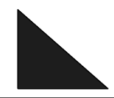 
Then canny edge detection is applied to detect the shape of the geometric object. 
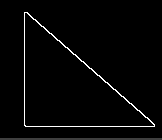 
Then a blur is applied to smooth out the shape to enure that the contour detection is not confused by the sharpness of the diagonal. 
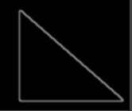 
By this stage the contour is detected with the findContours() function and put into a vector: "contours".
Because of the need to distinguish between a right triangle and a triangle, i.e. a triangle where one of the angles are 90 degrees and one that hasn't,
the vertices are extracted.

Then the angles are calculated using trigonometry, first each side length is calculated from the
vertices using the norm() function and then the dot product is used to calculate the cosine of the angle between two sides of the
polygon. The dot product is calculated using the dot() function, and the cosine of the angle is then calculated using the acos() function.

Then it is checked whether any of the three angles are 90 degrees and the contours drawn onto the image and shown.

### Results and evaluation

As can be seen when running the program, the program is able to tell a right triangle from a triangle. 
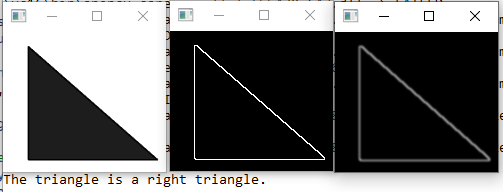 
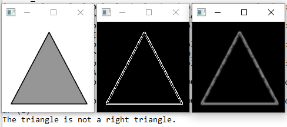 
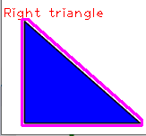 

The result is somewhat disappointing the program is able to tell a right triangle from a triangle. But the attempt to make the program classify squares
into the 8 different types of squares was not successful.

### Use case 2

### Methodology and process

The video file troels.mp4 is a recording of the author moving around. To find the face in this video the cascadeclassifier class is used.
It is intended to find objects in images or video based on a pre-trained model but it is most known for being used to find faces in videostreams.
An example can be seen here:
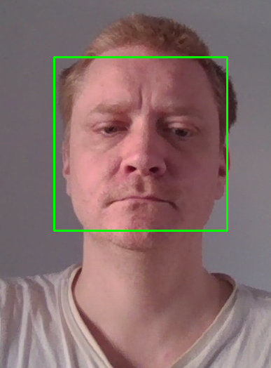 

After an instance of the cascadeclassifier has been created a pretrained model from the sample models from opencv is loaded (haarcascade_frontalface_default.xml).
The algorithm used is the Viola-Jones Face Detection Technique also known as Haar Cascade.

Then an instance of the VideoCapture class is created and the video loaded, this is then put into a Mat, frame by frame in the while loop which will run until there are no more frames in the video. The video playback will not start until a key is pressed.

Preprocessing is done by converting the frame to grayscale with the cvtColor function. 
A vector containing a Rect is declared to contain the detected faces.
Then the facemodel is applied using the detectMultiScale method and put into the vector.

Using a for loop a rectangle is then drawn onto the original color frame of the video.

Finally to prevent playback from starting until ready a waitkey statement with a 10 millisecond delay is used.

### Results and evaluation

As can be seen when running the program, the program is able to find faces in the video stream with some limitations. 
Here in the image from before the algorithm is easily able to find the face in the video: 
 
However if challenged the detection breaks down or gets confused. 
Here when the head is turned to a profile the detection can't find faces anymore because it has only been trained on front facing images of faces. 
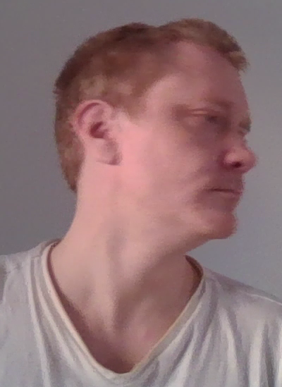 
Here where the head is slightly outside the frame the algorithm detects a face in the nostrils and philtrum. 
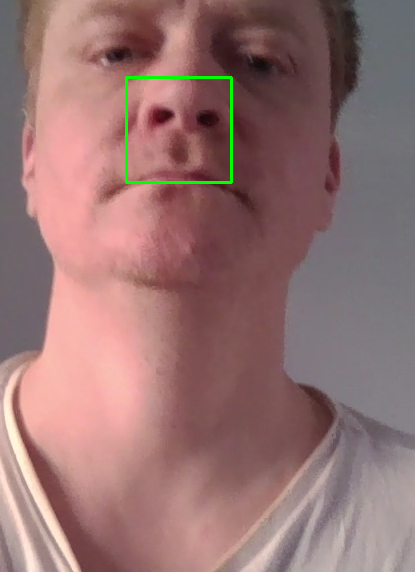 
Interestingly it has no problem with the face turned down or when grimacing: 
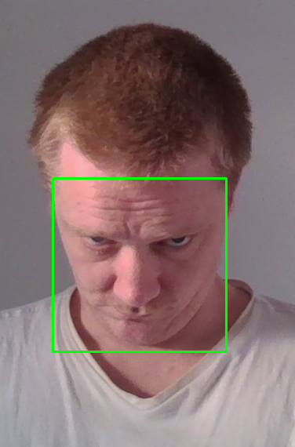
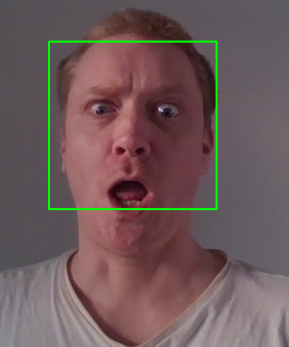 

The result is somewhat disappointing the program is able to tell a right triangle from a triangle. But the attempt to make the program classify squares
into the 8 different types of squares was not successful.

## Appendix
